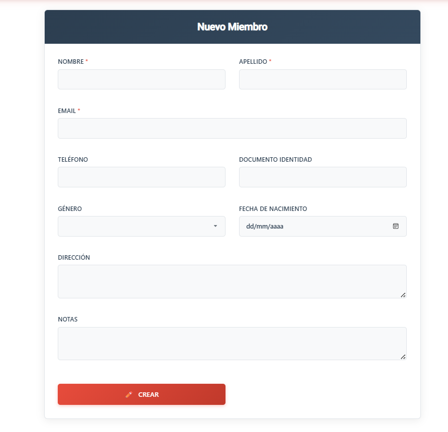
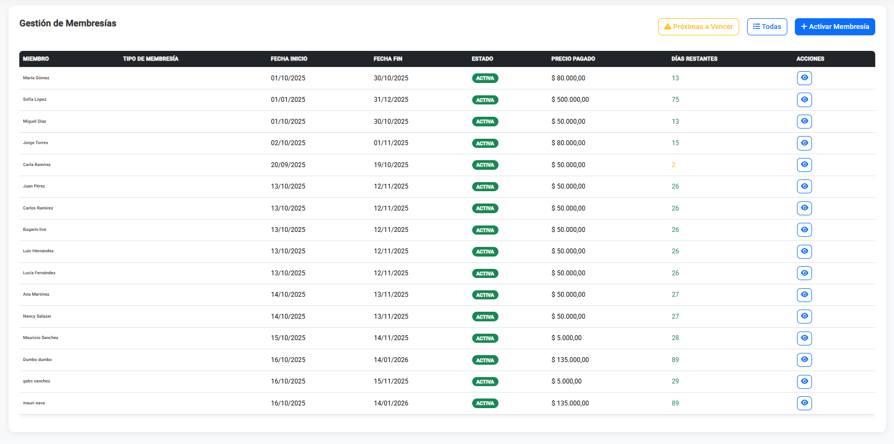
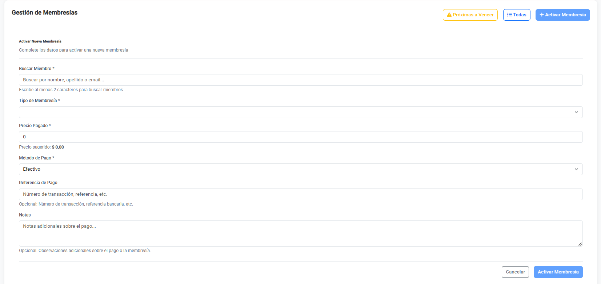
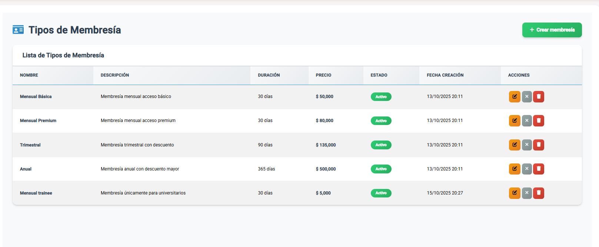
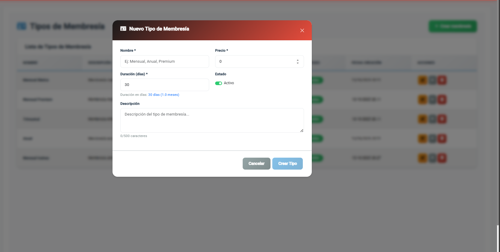
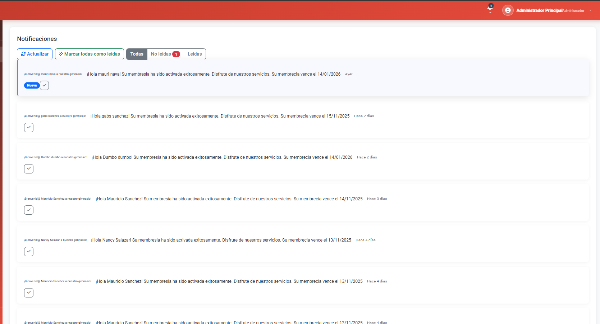

#Gigys - sistema de gestion de gimnasio

Proyecto fullstack con **Angular** y *Spring boot* 

Vista del login

  

Vista del dashboard

  

Vista del dashboard

  

Nuevo miembro

  

Gestión de membresias

  

Activar membresias

  

Tipos de membresias

  

Crear tipo membresia

  

Notificaciones

  

